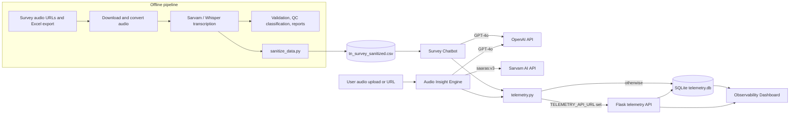

# Survey-Bot

Turn Tamil-language field survey recordings into transcripts, structured insights and a natural-language Q&A chatbot, with cost and latency telemetry for every API call.


## Overview

Survey-Bot is a set of Streamlit apps and Python pipeline scripts built around a door-to-door political opinion survey. Field enumerators record short audio interviews; this project transcribes those recordings, extracts structured answers and lets an analyst query the results in English or Tamil.

The repository contains three Streamlit apps:

| App | Entry point | What it does |
| --- | --- | --- |
| Survey Chatbot | `survey_chatbot.py` (shim) or `apps/survey_chatbot/app.py` | Chat interface over a survey dataset (transcripts plus coded answers such as MLA satisfaction, preferred CM, voting intent, caste, age group, gender, occupation). |
| Audio Insight Engine | `apps/audio_transcription/app.py` | Upload an audio file or paste a URL, transcribe it with Sarvam AI (Tamil), then use GPT-4o to translate it to English and extract party preference, sentiment, pros, cons, key issues and a summary. |
| Observability Dashboard | `apps/dashboard/app.py` | Dark-themed dashboard of API spend, request volume, latency, token usage and recent traces, read from the telemetry store. |

It also contains the offline batch pipeline used to build the dataset (audio download, transcription benchmarks, answer validation, QC classification and report generation) under `src/logic/` and `scripts/`.

All data in this repository is synthetic. The bundled dataset, audio files and telemetry database were generated by `scripts/generate_synthetic_data.py` and contain no real survey responses, recordings or personal data. See [`data/README.md`](data/README.md).

## Key features

- **Hybrid query routing.** For each question, GPT-4o returns a JSON decision: `code` (a pandas expression evaluated against the survey DataFrame for counts and breakdowns), `search` (keyword search over Tamil transcripts, then an LLM summary with `[Sample ID]` citations), `more_results` (next page of matches) or `chat`.
- **Bilingual answers.** Responses in English or Tamil, selected in the sidebar, with suggested questions in both languages.
- **Long-audio transcription.** Audio is resampled to 16 kHz mono WAV with PyAV and split into 28-second chunks to stay under the Sarvam real-time limit (`saaras:v3`, `ta-IN`).
- **Built-in telemetry.** Every OpenAI and Sarvam call is logged with token counts, estimated USD cost (from a static price table in `src/core/telemetry.py`) and latency, either to a local SQLite database or to a small authenticated HTTP API.
- **Synthetic demo data.** `scripts/generate_synthetic_data.py` builds a fictional 240-row dataset with the exact columns the chatbot expects, three tiny WAV files and a seeded telemetry database, so every app runs out of the box.
- **Data sanitisation script.** `scripts/sanitize_data.py` merges your own transcripts with survey answers and keeps only the analysis columns, producing `data/production/tn_survey_sanitized.csv`.
- **Model benchmarking scripts.** Compare Sarvam, OpenAI Whisper and open Indic Whisper models for transcription accuracy against survey answers (`scripts/benchmarks/`, `src/logic/validation/`).

## Architecture



Key modules:

- `src/core/config.py`: paths (all relative to the repo root), model names (`gpt-4o`, `whisper-1`, `saaras:v3`) and API keys read from the environment or a local `.env`. Creates the `data/` subfolders on import.
- `src/core/telemetry.py`: `log_llm_call`, `log_sarvam_call`, `Span` timer and cost estimation. Posts to the telemetry API when `TELEMETRY_API_URL` is set, otherwise writes to SQLite in a background thread.
- `src/core/telemetry_api.py`: Flask service (port 5005, bound to 127.0.0.1) with bearer-token protected endpoints `/api/telemetry/llm`, `/api/telemetry/sarvam` and `/api/telemetry/apps`. Used to collect telemetry from a cloud-hosted app (for example through a tunnel).
- `src/logic/chatbot/engine.py`: `SurveyChatEngine` (decision, code execution, transcript search, answer synthesis).

## Tech stack

- Python, Streamlit, pandas, NumPy, Plotly
- OpenAI API (GPT-4o; Whisper in benchmark scripts)
- Sarvam AI speech-to-text (`sarvamai` SDK, real-time and batch job APIs)
- PyAV and pydub for audio conversion and chunking
- SQLite for telemetry, optional Flask API
- openpyxl for Excel survey exports

## Getting started

### Prerequisites

- Python 3.10 to 3.12 (verified on 3.12; the dev container uses 3.11). Python 3.13 is not supported because `pydub` depends on the removed `audioop` module.
- An OpenAI API key (required by the chatbot and the audio app).
- A Sarvam AI API key (required by the audio app).

### Install

```bash
git clone https://github.com/Katta041/Survey-Bot.git
cd Survey-Bot
python3 -m venv .venv
source .venv/bin/activate
pip install -r requirements.txt
```

`pydub` may print a warning that ffmpeg is not found. The apps only use pydub on WAV data, so this warning is harmless for them.

### Configuration

Copy the example file and fill in your own values:

```bash
cp .env.example .env
```

| Variable | Required | Used by | Purpose |
| --- | --- | --- | --- |
| `OPENAI_API_KEY` | Yes | Chatbot, Audio Insight Engine | OpenAI API access (GPT-4o). |
| `SARVAM_API_KEY` | Audio app only | Audio Insight Engine | Sarvam AI speech-to-text. |
| `TELEMETRY_API_URL` | No | All apps | Base URL of the telemetry API. If unset, telemetry is written to `data/db/telemetry.db`. |
| `TELEMETRY_API_KEY` | With `TELEMETRY_API_URL` | Telemetry API and clients | Shared bearer token for the telemetry API. There is no default: the API refuses to start without it, and clients fall back to local SQLite when it is not set. |

On Streamlit Community Cloud, `TELEMETRY_API_URL` and `TELEMETRY_API_KEY` can also be supplied through `st.secrets`. `OPENAI_API_KEY` and `SARVAM_API_KEY` are read from environment variables by `src/core/config.py`.

The `.env` file and `.streamlit/secrets.toml` are listed in `.gitignore`.

### Run

Run each app from the repository root:

```bash
# Survey chatbot (uses the synthetic data/production/tn_survey_sanitized.csv)
streamlit run survey_chatbot.py

# Audio transcription and insight app
streamlit run apps/audio_transcription/app.py

# Observability dashboard
streamlit run apps/dashboard/app.py

# Optional: telemetry API (Flask is not in requirements.txt)
pip install flask
export TELEMETRY_API_KEY="$(python -c 'import secrets; print(secrets.token_urlsafe(32))')"
python -m src.core.telemetry_api
```

Streamlit serves on http://localhost:8501 by default. The repository also includes a dev container (`.devcontainer/devcontainer.json`) that installs the requirements and starts the chatbot on port 8501.

## Usage examples

Survey Chatbot questions (from the built-in suggestions):

- "Who do people support for next CM?" (routed to a pandas `value_counts()` and phrased as a natural answer)
- "Break down CM support by caste"
- "What are people's main concerns?" (routed to transcript search with cited sample IDs)
- "Show me more" (returns further transcript matches for the previous search)

Audio Insight Engine: choose "Upload Audio File" (MP3, WAV, M4A, OGG) or "Paste Audio URL", click "Process Audio", then review the Tamil transcript, English translation and the extracted insight cards. The WAV files in `data/audio_samples/` are tones and silence for smoke tests only; supply your own Tamil recordings to see meaningful output.

## Project structure

```text
.
├── apps/
│   ├── survey_chatbot/app.py       # Chatbot UI
│   ├── audio_transcription/app.py  # Audio Insight Engine UI
│   ├── dashboard/app.py            # Observability dashboard
│   └── legacy/survey_chatbot.py    # Earlier single-file chatbot
├── src/
│   ├── core/                       # config, telemetry, telemetry API
│   ├── logic/
│   │   ├── chatbot/engine.py       # SurveyChatEngine
│   │   ├── transcription/          # Sarvam, Whisper and Indic Whisper pipelines
│   │   ├── validation/             # Compare transcripts against survey answers
│   │   ├── summarization/          # Column and QC summaries
│   │   ├── reporting/              # Markdown and PDF report generation
│   │   └── classify_audio_tn.py    # GPT-4o QC classification of recordings
│   └── utils/                      # Audio download, conversion, enhancement
├── scripts/                        # Benchmarks, data prep, inspection and debug helpers
├── tests/                          # Ad hoc verification scripts (see Testing)
├── data/
│   ├── README.md                   # Describes the synthetic data
│   ├── production/                 # Synthetic dataset used by the chatbot
│   ├── audio_samples/              # Generated test tones (no speech)
│   └── db/                         # Synthetic telemetry database
├── survey_chatbot.py               # Root shims so Streamlit Cloud can run the apps
├── survey_chatbot_tn.py
├── audio_transcription_app.py
├── observability_dashboard.py
├── telemetry.py                    # Legacy import shim for src.core.telemetry
└── requirements.txt
```

## Pipeline scripts

The batch scripts under `src/logic/` and `scripts/` were written for local research runs and are not covered by `requirements.txt`. Before running them, note that:

- Many import a local, git-ignored `framework_config.py` (API keys and data directories). File paths are relative to the repository root, under `data/`, so run them from the root.
- Some need extra packages, depending on the script: `torch`, `torchaudio`, `transformers`, `scikit-learn`, `soundfile`, `noisereduce`, `matplotlib`, `fpdf`, `weasyprint`, `markdown-it-py`, `python-pptx`, `flask`.
- They expect your own raw survey exports and audio under `data/raw/` and `data/audio_samples/`. These are not part of the repository and must stay out of version control.

## Testing

There is no CI yet. The `tests/` folder holds:

- `python -m tests.test_synthetic_data` (or `python -m pytest tests/test_synthetic_data.py` if pytest is installed): offline checks of the synthetic dataset and the chatbot engine's pandas and transcript-search helpers.
- `python -m tests.test_shim` and `python tests/repro_telemetry.py` check the telemetry shim and logging, and run offline.
- `test_chatbot.py`, `test_chatbot_tn.py`, `test_strict.py`, `test_ui_questions.py` and `test_intensive.py` exercise the chatbot prompts against live OpenAI calls and your own local data files (not included), and need `framework_config.py`.

## Deployment

The root-level shim files (`survey_chatbot.py` and others) exist so the apps can be deployed to Streamlit Community Cloud with the repository root as the working directory. Set `OPENAI_API_KEY` (and `SARVAM_API_KEY` for the audio app) as environment secrets, and optionally `TELEMETRY_API_URL` and `TELEMETRY_API_KEY` to send telemetry to a self-hosted telemetry API.

## Status and roadmap

Status: proof of concept, used for one constituency survey dataset. Not hardened for production.

Planned or recommended next steps:

- Add a pytest suite with mocked OpenAI and Sarvam clients, and a CI workflow.
- Sandbox or replace `eval`/`exec` of LLM-generated pandas code in the chatbot engine.
- Show a clear message, rather than a traceback, when `OPENAI_API_KEY` is missing in the chatbot.
- Move pipeline-only dependencies into a separate requirements file and replace `framework_config.py` with `src/core/config.py` in the scripts.

## Security and data handling

- API keys are supplied through environment variables, a local `.env` file or Streamlit secrets. None are stored in the repository.
- The repository contains only synthetic data: no real respondents, recordings, names, phone numbers or other personal data.
- Real survey data of this kind (political opinion, caste) is sensitive personal data. Keep raw exports, audio, names and phone numbers out of version control, and obtain the right consents before processing.
- The chatbot executes pandas code generated by the LLM against the loaded DataFrame. Run it only for trusted users.

## Licence

No licence has been chosen yet; all rights reserved.

## Author

Rohith Katta - [github.com/Katta041](https://github.com/Katta041)
