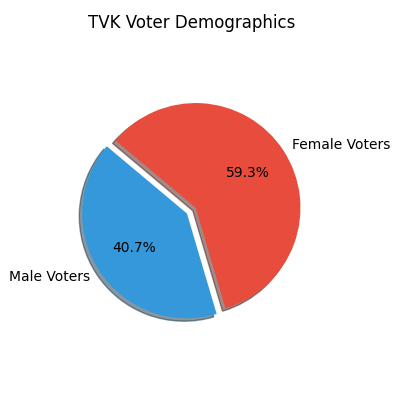
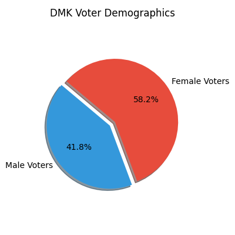

# Thiruvottiyur Constituency Survey Report

**Total Survey Points:** 384  
*Source: Validated Field Survey Database (Excel Metadata)*

## 1. Overall Party Support & Demographics
The following illustrates the breakdown of voter support for the upcoming 2026 elections, including male/female demographic splits. Data is computationally verified.

| Party / Leader | Logo | Total Support | Male Voters | Female Voters |
|---|---|---|---|---|
| **TVK** |  | 204 | 83 | 121 |
| **DMK** |  | 122 | 51 | 71 |
| **AIADMK** |  | 32 | 17 | 15 |
| **Others/Undecided** |  | 22 | 5 | 17 |
| **NTK** |  | 4 | 2 | 2 |

*Source: Cross-tabulation of Q4 (Vote 2026) and Q9 (Gender) from Anonymized Field Dataset*

---

## 2. Qualitative Insights: Vijay (TVK)
Using advanced AI analysis on native Tamil audio transcriptions, the following primary drivers were identified.

### Top 5 Reasons for SUPPORTING TVK
- Vijay is viewed as a leader who genuinely cares for the farmers, portraying himself as a friend of the agricultural community [Audio IDs: 9c1057e7-5b61-4839-b705-30eac941dc6f, c92b6dab-9f6b-48c9-b745-a2028fc2833c, 0d69ed94-8a32-4976-baa0-1c9f5c3f4e57].
- Vijay is believed to be a capable administrator who can bring about a positive change in governance and improve the state's administration [Audio IDs: e104311b-d1b9-4832-8ad3-999e9dffb19d, e9446785-ac21-4f9e-bf47-a6b3b4e14d91, bb3d7212-6916-4c33-8e1c-a0358ecf0614].
- Voters see Vijay as an approachable leader, someone who will be easily accessible and receptive to the people's concerns [Audio IDs: bf723be3-7097-4f59-9d3e-9d214aad3720, 9c1057e7-5b61-4839-b705-30eac941dc6f, 978b3526-f687-4b9d-bfde-fea8e36a0ccf].
- Many see Vijay as a strong advocate for change, representing a break from the traditional political parties and offering a fresh perspective on leadership [Audio IDs: 1cc46bce-58a7-47ae-8fe9-82683c90a2c7, 5d4532a5-aa76-44b1-8e6c-d85216ea2013, 22c319df-e3b1-49e4-ae5c-2605ed055e0e].
- Vijay's popularity among the youth and his image as a dynamic leader draw significant support, appealing to a demographic that desires representation in governance [Audio IDs: e104311b-d1b9-4832-8ad3-999e9dffb19d, 4501af9c-5f42-418c-96fc-37392e29bc50, 6c7df398-aeb7-4e39-ac30-38fb7ce34a9c].

### Top 5 Reasons for NOT SUPPORTING TVK
- Voters feel that the current administration has not brought significant improvements to infrastructure, with mentions of unfulfilled promises and insufficient development in local areas [Audio IDs: e8bbe1ee-fc26-4d6c-bebf-087fd6b8f800, f9992f77-251f-499a-b064-5fbf802e99d3, a2681cff-b03c-4cac-98f5-9e62da223fff, 7cdad563-b09d-412c-8fec-9400f2d175d4, a89b60a4-3f4a-4374-bef6-53ed66ef1f2a]
- Residents are dissatisfied with the availability and distribution of benefits, with instances of people not receiving expected government support or rations [Audio IDs: 74eab299-6ff9-4010-9a02-70680a64774c, f9992f77-251f-499a-b064-5fbf802e99d3, d3eb95f4-0cbe-47e7-9dda-854526a9944f]
- There is a perception that the leadership is not easily approachable or visible to the people, leading to feelings of disconnection and neglect [Audio IDs: 9d39bcd3-d5b3-464e-b5b1-78e782b7f3ef, 870f3a36-c69c-4d7d-b661-d460511891c6, c3a69845-32ab-4565-bb66-1b4b7bb0754a, df137cf2-3dee-4e59-97ed-92b0ed8da135, eaa3a32c-dfa2-4951-8fe6-5e5fbdbdb726]
- Voters express a need for leadership change due to dissatisfaction with current governance, hoping a new administration might better address their concerns [Audio IDs: 9bee5375-ad83-4314-9df4-82f0df947731, d3eb95f4-0cbe-47e7-9dda-854526a9944f, 786669fe-40ad-47d4-92ad-ec411e75a65a, ef402539-61d0-4148-b5a3-2d1edc43d067]
- Some voters continue to support opposition parties, expressing historical loyalty and belief in their past efficacy over the current ruling party [Audio IDs: 13299021-7692-4f02-95be-d6f403f90ae3, 67d2dc67-6036-460c-9a95-56b37777a7bc, 115f82c0-6686-4e0e-9fde-e06f642abb18]

*Source: AI extraction from Sarvam Speech-to-Text Tamil Audio Transcripts*

---

## 3. Qualitative Insights: M.K. Stalin (DMK)

### Top 5 Reasons for SUPPORTING DMK
- They prefer the leadership of MK Stalin for his approachable nature and good governing skills [Audio IDs: eaa3a32c-dfa2-4951-8fe6-5e5fbdbdb726, a89b60a4-3f4a-4374-bef6-53ed66ef1f2a, 4195f21c-f6ee-40df-92da-8515e0ab2754]
- DMK is appreciated for consistently supporting farmers and being perceived as true friends of agriculture [Audio IDs: eaa3a32c-dfa2-4951-8fe6-5e5fbdbdb726, 74eab299-6ff9-4010-9a02-70680a64774c, 06640e64-bb2f-4655-9de2-2522c9798c6f, a2113c20-3314-4c07-ba80-578abe013bc5]
- Voters have a historical preference for DMK, having consistently supported them in the past two decades [Audio IDs: eaa3a32c-dfa2-4951-8fe6-5e5fbdbdb726, df137cf2-3dee-4e59-97ed-92b0ed8da135, a89b60a4-3f4a-4374-bef6-53ed66ef1f2a]
- The perception of DMK's administration being transparent and for the welfare of people encourages voter support [Audio IDs: eaa3a32c-dfa2-4951-8fe6-5e5fbdbdb726, ff8dc59a-d26b-47cb-b356-fd8118650200, 115f82c0-6686-4e0e-9fde-e06f642abb18]
- MK Stalin's good track record in governance and being seen as a capable leader attracts voter base [Audio IDs: 8c713e69-df20-4cbf-b240-18cee88f1fda, 4195f21c-f6ee-40df-92da-8515e0ab2754]

### Top 5 Reasons for NOT SUPPORTING DMK
- Dissatisfaction with local MLAs' performance, with many feeling that their needs are not addressed and there is a lack of visible improvement in their areas [Audio IDs: 9c1057e7-5b61-4839-b705-30eac941dc6f, 93e4c635-2981-4a13-9330-6e24375133e1, 978b3526-f687-4b9d-bfde-fea8e36a0ccf]
- Desire for a change in governance, with some expressing general dissatisfaction with the current administration and wanting new leadership [Audio IDs: bf723be3-7097-4f59-9d3e-9d214aad3720, 67d2dc67-6036-460c-9a95-56b37777a7bc]
- Economic issues such as the high cost of living are persistent, and some blame the current administration for not effectively addressing these concerns [Audio IDs: c92b6dab-9f6b-48c9-b745-a2028fc2833c, c9925ecf-f5c8-4997-995d-44f8afd72c61]
- A perception that the current government only benefits a select few or specific communities rather than the general populace [Audio IDs: 5739a559-e07f-4080-9c48-a09e4f7ff886, 9d39bcd3-d5b3-464e-b5b1-78e782b7f3ef]
- Support for opposition leaders like Vijay or Seeman, seen as fresh choices who might offer better leadership and governance [Audio IDs: 5b8a4951-f2cf-4931-83c5-ac6460978ddb, f9992f77-251f-499a-b064-5fbf802e99d3]

*Source: AI extraction from Sarvam Speech-to-Text Tamil Audio Transcripts*